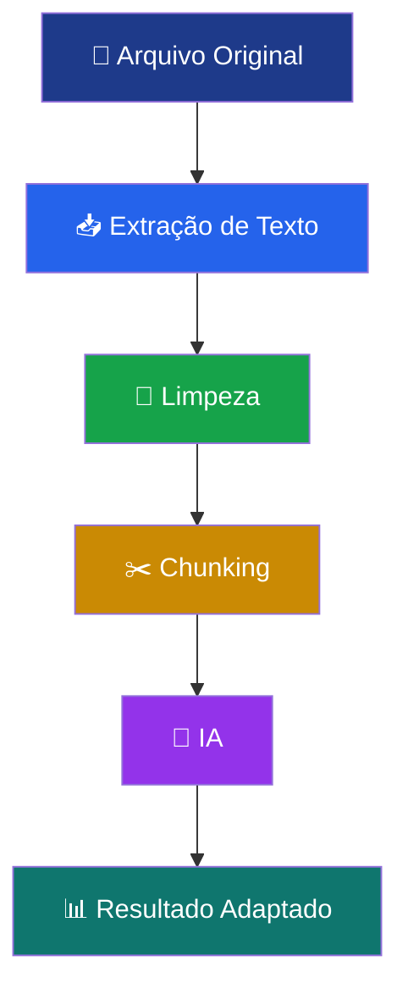
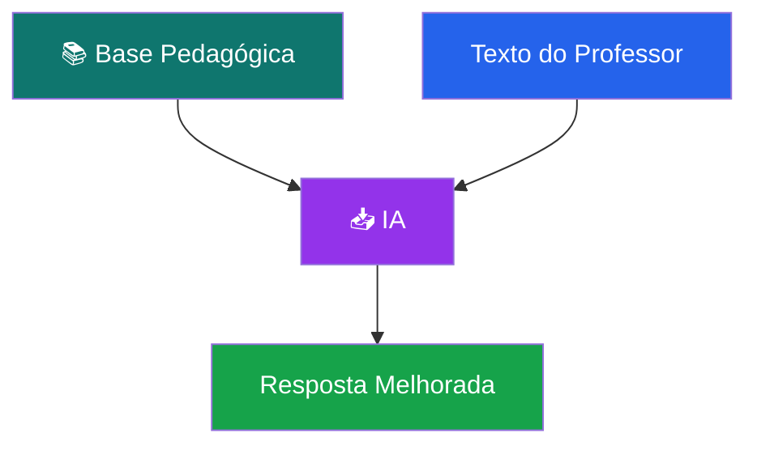

# 🧠📚 NeuroLearn — Processamento de Texto & Inteligência Artificial

> Guia técnico sobre **limpeza de texto, chunking e uso de IA** no projeto NeuroLearn

---

# 🧹 ✂️ Etapa 1 — Limpeza e Quebra de Texto

Antes de enviar qualquer conteúdo para a IA, é necessário preparar o material.

## 🎯 Objetivo

* Melhorar a qualidade das respostas da IA
* Evitar erros e confusões
* Reduzir custo e processamento

---

# 🧹 Limpeza de Texto (Cleaning)

## ❗ Problema

Arquivos como PDFs e imagens geram textos assim:

```text
Página 1
Capítulo 3

A Revolução Industrial foi um processo de trans-
formação econômica...
```

---

## ✅ Resultado esperado

```text
A Revolução Industrial foi um processo de transformação econômica...
```

---

## 🔧 O que fazer

* Remover cabeçalhos/rodapés
* Remover números de página
* Corrigir palavras quebradas
* Remover espaços extras
* Normalizar texto

---

## 💻 Exemplo em Java

```java
text = text.replaceAll("\\n", " ");
text = text.replaceAll("\\s+", " ");
text = text.replaceAll("-\\s+", ""); // corrige palavras quebradas
```

---

# ✂️ Chunking (Divisão de Texto)

## 🎯 Objetivo

Dividir textos grandes em partes menores para melhorar o desempenho da IA.

---

## ❌ Errado

* Enviar um PDF inteiro para a IA

---

## ✅ Correto

Dividir em blocos:

* 500 a 1000 palavras por parte

---

## 💻 Exemplo em Java

```java
int chunkSize = 1000;

for (int i = 0; i < text.length(); i += chunkSize) {
    String chunk = text.substring(i, Math.min(text.length(), i + chunkSize));
}
```

---

# 🔄 Pipeline Completo



---

# 🤖 Etapa 2 — Inteligência Artificial

---

# 🧠 Qual IA usar?

## 🥇 Recomendação

### ✔ OpenAI (GPT)

---

## 🎯 Por que usar?

* Excelente para texto educacional
* Fácil integração com Java
* Não precisa treinar modelo
* Alta qualidade de resposta
* Suporte a instruções (prompt)

---

## 🟡 Alternativa

* Google Gemini (boa opção secundária)

---

## ❌ Não recomendado

* Treinar modelo próprio
* Rodar IA local

---

# ⚙️ Como usar a IA

## 🔹 Fluxo


---

# 🧾 Exemplo de Prompt

```text
Você é um especialista em educação inclusiva.

Adapte o texto abaixo para um aluno com TEA nível 1:

- Use frases curtas
- Use linguagem simples
- Evite metáforas
- Organize em tópicos
- Não invente informações

Texto:
{conteúdo}
```

---

# 🚫 Como evitar alucinações

## ✔ Boas práticas

* Sempre incluir:

```text
Use apenas o conteúdo fornecido
Não adicione informações novas
```

* Usar chunking
* Usar temperatura baixa (0.2)
* Permitir revisão do professor

---

# 🧠 “Treinar” a IA (na prática)

## ❗ Importante

Vocês NÃO vão treinar um modelo do zero.

---

## ✅ O que fazer:

### 🔹 1. Prompt Engineering

* Criar instruções claras
* Padronizar respostas

---

### 🔹 2. Base de conhecimento (RAG)



---

## 💡 Exemplos de base:

* Regras de linguagem simples
* Exemplos de adaptação
* Diretrizes educacionais

---

# 🏗 Tecnologias Utilizadas

## 🔹 Processamento de Texto

* Java (String + Regex)

## 🔹 Extração

* Apache PDFBox
* Apache POI
* Tesseract OCR

## 🔹 IA

* OpenAI API (GPT)

---

# 🏁 Conclusão

## ✔ Pipeline ideal:

* Limpeza → melhora qualidade
* Chunking → melhora precisão
* Prompt → controla comportamento
* IA → adapta conteúdo

---

## 🎯 Resultado final

Um sistema que:

* entende o conteúdo
* adapta para alunos com TEA
* entrega material acessível
* mantém o professor no controle

---

# 💬 Insight Final

> A IA não é mágica — o resultado depende da qualidade do que você envia.

---
