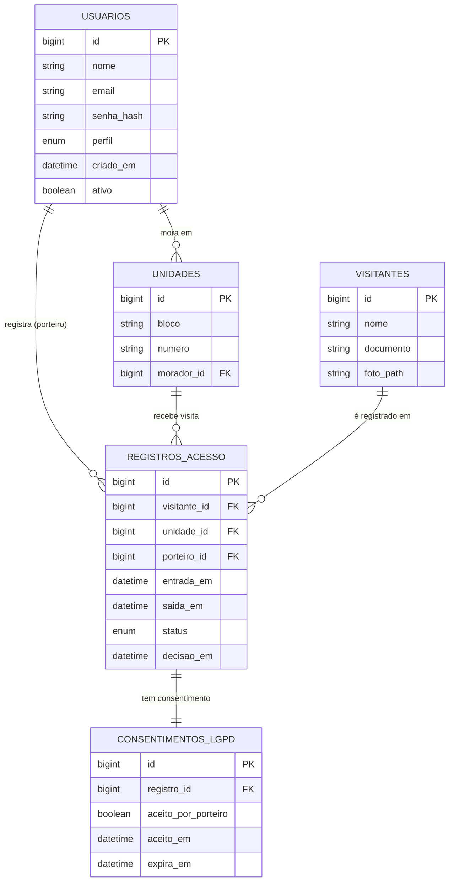
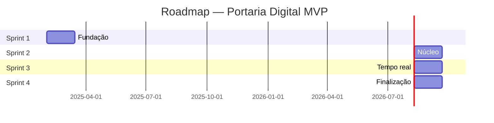
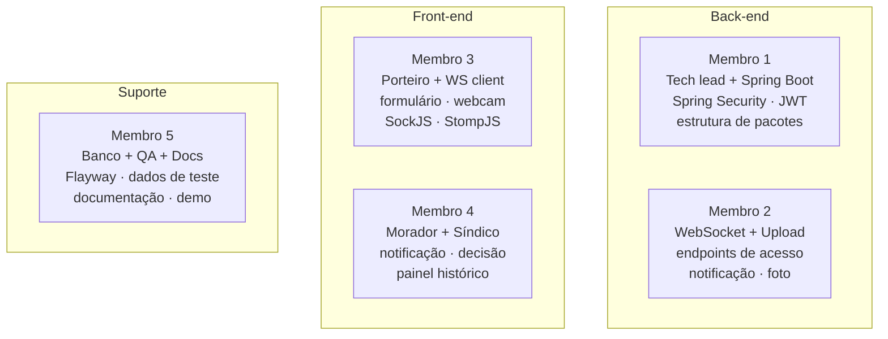

# Portaria Digital — MVP

> Documento técnico do Produto Mínimo Viável  
> TCC — Desenvolvimento de Sistemas · ETEC · 3º Ano

---

## O que é o MVP

Sistema web de controle de acesso para condomínios residenciais com **3 perfis de usuário**: porteiro, morador e síndico.

O núcleo é o **ciclo completo de uma visita** — do registro na portaria até o histórico consultável — funcionando de ponta a ponta antes de qualquer incremento.

> **Critério de sucesso:** O MVP está completo quando for possível demonstrar, ao vivo, o ciclo completo:
> porteiro registra visitante com foto → morador recebe notificação em tempo real e decide → porteiro vê a resposta → síndico consulta o histórico do evento.

---

## Métricas do MVP

| Item | Quantidade |
|---|---|
| Perfis de usuário | 3 (porteiro · morador · síndico) |
| Telas no MVP | 8 mínimas funcionais |
| Tabelas no banco | 5 |
| Endpoints REST | 14 |
| Sprints | 4 (~6 semanas cada) |
| Prazo total estimado | 6 meses |

---

## Stack Tecnológica

```mermaid
graph LR
    subgraph Frontend
        R[React 18]
        RR[React Router]
        AX[Axios]
        WS[SockJS + StompJS]
        CTX[Context API]
    end

    subgraph Backend
        SB[Spring Boot 3]
        SEC[Spring Security + JWT]
        WEB[WebSocket STOMP]
        JPA[Spring Data JPA]
        MAIL[JavaMailSender]
    end

    subgraph Banco
        MY[MySQL 8]
        FLY[Flyway migrations]
    end

    Frontend -->|HTTP REST| Backend
    Frontend -->|WebSocket| Backend
    Backend -->|JPA| Banco
```



---

## Escopo do MVP

### Legenda

| Símbolo | Significado |
|---|---|
| ✅ | Dentro do MVP |
| ❌ | Fora do MVP |
| 🔜 | Incremento futuro |

---

### Módulo 1 — Autenticação e cadastros

| Status | Feature | Detalhe técnico |
|---|---|---|
| ✅ | Login por e-mail e senha com JWT | Spring Security + token |
| ✅ | Cadastro de moradores e unidades | CRUD via painel do síndico |
| ✅ | Cadastro de porteiros | nome, login, senha provisória |
| ❌ | Redefinição de senha por e-mail | link com token temporário |
| ❌ | Login social (Google, Facebook) | OAuth2 — fora do escopo |

---

### Módulo 2 — Registro de visitante (porteiro)

| Status | Feature | Detalhe técnico |
|---|---|---|
| ✅ | Formulário de entrada | nome, documento, unidade destino |
| ✅ | Captura de foto via webcam | `navigator.mediaDevices` — sem hardware extra |
| ✅ | Disparo de notificação ao morador | WebSocket STOMP após salvar no banco |
| ✅ | Registro de saída do visitante | porteiro clica manualmente |
| 🔜 | Pré-cadastro de visitante frequente | morador pré-autoriza antes da chegada |
| ❌ | Reconhecimento facial automático | complexidade fora do MVP |
| ❌ | Leitura de QR Code ou biometria | requer hardware específico |

---

### Módulo 3 — Autorização (morador)

| Status | Feature | Detalhe técnico |
|---|---|---|
| ✅ | Notificação em tempo real | WebSocket — aparece sem recarregar a página |
| ✅ | Visualização de foto, nome e documento | morador vê quem chega antes de decidir |
| ✅ | Botões autorizar / recusar | resposta via WebSocket ao porteiro |
| ✅ | Histórico pessoal de visitas | apenas visitas da própria unidade |
| 🔜 | Notificação por e-mail como fallback | quando WebSocket não está disponível |
| ❌ | Notificação push mobile (PWA) | service workers — incremento futuro |

---

### Módulo 4 — Histórico (síndico)

| Status | Feature | Detalhe técnico |
|---|---|---|
| ✅ | Listagem com filtros | por unidade, data e status |
| ✅ | Visualização individual de cada registro | foto, dados, horários, decisão do morador |
| 🔜 | Exportação PDF / CSV | pós-MVP |
| ❌ | Dashboard com gráficos | métricas visuais — fora do MVP |
| ❌ | Alertas automáticos por padrão suspeito | IA/ML — fora do escopo do TCC |

---

## Banco de Dados

### Diagrama de entidades



### Enums

```sql
-- perfil em USUARIOS
ENUM('PORTEIRO', 'MORADOR', 'SINDICO')

-- status em REGISTROS_ACESSO
ENUM('AGUARDANDO', 'AUTORIZADO', 'RECUSADO', 'SAIU')
```

> `foto_path` armazena o caminho relativo do arquivo — não o blob. Imagens ficam no servidor de arquivos local.

---

## API REST

### Autenticação

| Método | Endpoint | Descrição |
|---|---|---|
| POST | `/auth/login` | Retorna JWT |
| POST | `/auth/logout` | Invalida token |

### Usuários e unidades

| Método | Endpoint | Descrição |
|---|---|---|
| GET | `/usuarios` | Lista usuários (síndico) |
| POST | `/usuarios` | Cria morador ou porteiro |
| GET | `/unidades` | Lista unidades |
| POST | `/unidades` | Cria unidade |

### Visitantes

| Método | Endpoint | Descrição |
|---|---|---|
| POST | `/visitantes` | Cria visitante + upload foto |
| GET | `/visitantes/{id}` | Busca visitante |

### Registros de acesso

| Método | Endpoint | Descrição |
|---|---|---|
| POST | `/acessos` | Registra entrada (porteiro) |
| PUT | `/acessos/{id}/autorizar` | Morador autoriza |
| PUT | `/acessos/{id}/recusar` | Morador recusa |
| PUT | `/acessos/{id}/saida` | Porteiro registra saída |
| GET | `/acessos` | Histórico com filtros (síndico) |
| GET | `/acessos/minha-unidade` | Histórico do morador |
| GET | `/acessos/{id}` | Detalhe de um registro |

### WebSocket

| Canal | Tópico | Descrição |
|---|---|---|
| `/ws/notificacoes` | `/user/{id}/fila/notificacoes` | Canal STOMP por usuário |

> O back-end publica no tópico do morador ao salvar o registro. O front-end subscreve ao fazer login.

---

## Sprints



---

### Sprint 1 — Semanas 1 a 6
**Fundação — autenticação, cadastros e banco**

- Configuração do projeto Spring Boot e React
- Modelagem e criação das tabelas com Flyway
- CRUD de usuários, unidades e porteiros
- Login com JWT e controle de perfil por enum
- Telas de login e painel inicial para cada perfil

> **Entrega:** Os 3 perfis conseguem fazer login e ver suas telas respectivas.

---

### Sprint 2 — Semanas 7 a 12
**Núcleo — registro de visitante e captura de foto**

- Formulário de registro de visitante no painel do porteiro
- Upload e armazenamento de foto via webcam
- Endpoint `POST /acessos` com criação do visitante e do registro vinculados
- Validação de campos no front e no back

> **Entrega:** Porteiro consegue registrar uma visita completa com foto e o dado aparece no banco.

---

### Sprint 3 — Semanas 13 a 18
**Tempo real — WebSocket e decisão do morador** ⚠️ Sprint mais arriscada

- Configuração do WebSocket com STOMP no back-end
- Integração SockJS + StompJS no front-end
- Notificação automática ao morador após o porteiro salvar
- Tela do morador com botões de autorizar/recusar
- Resposta voltando ao porteiro em tempo real

> **Entrega:** Ciclo completo funciona de ponta a ponta.

---

### Sprint 4 — Semanas 19 a 24
**Finalização — histórico, ajustes e demo**

- Painel de histórico do síndico com filtros
- Registro de saída do visitante pelo porteiro
- Histórico pessoal do morador
- Tratamento de erros e feedbacks visuais
- Testes de fluxo completo
- Refinamento de UX
- Preparação e ensaio da demo para a banca
- Gravação de vídeo backup da demonstração

> **Entrega:** Sistema pronto para apresentação, com demo ao vivo e backup gravado.

---

## Divisão do Time



### Responsabilidades detalhadas

| Membro | Área | Responsabilidades |
|---|---|---|
| M1 | Back · Tech Lead | Spring Boot, Spring Security, JWT, estrutura de pacotes, revisão de PRs |
| M2 | Back · WebSocket | Config WebSocket STOMP, endpoints `/acessos`, lógica de notificação, upload de foto |
| M3 | Front · Porteiro | Login, painel porteiro, formulário, webcam, SockJS/StompJS, recebimento da decisão |
| M4 | Front · Morador/Síndico | Tela morador (notificação + botões), histórico pessoal, painel síndico com filtros |
| M5 | BD · QA · Docs | Modelagem, migrations Flyway, dados de teste, documentação TCC, demo e vídeo backup |

---

## Regras de Trabalho

- Git com branches por feature — ninguém commita direto na `main`
- Pull Request obrigatório com ao menos **1 aprovação** antes de mergear
- Reunião semanal de 30 min para alinhamento de bloqueios
- Cada sprint termina com uma **demo interna** para o grupo inteiro
- **Contrato de interface definido na semana 1** — DTOs e endpoints combinados antes de codar, para que back e front trabalhem em paralelo sem bloqueios

---

## Conformidade LGPD

A coleta de foto de visitantes exige atenção à Lei Geral de Proteção de Dados (Lei nº 13.709/2018).

### O que implementar no MVP

| Requisito | Implementação |
|---|---|
| Consentimento explícito | Campo obrigatório que o porteiro marca antes de salvar ("visitante foi informado e autorizou o registro de imagem") |
| Finalidade declarada | Exibida na tela de registro — "imagem usada exclusivamente para controle de acesso" |
| Prazo de retenção | `expira_em` na tabela `consentimentos_lgpd` — sugestão: 90 dias |
| Direito à exclusão | Endpoint `DELETE /visitantes/{id}` remove foto e dados pessoais |

> A tabela `consentimentos_lgpd` é pequena, não dá trabalho para implementar, mas protege o grupo na banca quando perguntarem sobre privacidade das fotos.

---

## Alertas e Riscos

| Risco | Probabilidade | Mitigação |
|---|---|---|
| WebSocket instável na demo | Alta | Localhost + vídeo backup gravado |
| Sprint 3 atrasar | Média | Iniciar config WS no fim da Sprint 2 |
| Câmera não funcionar na banca | Média | Testar ambiente da apresentação antecipadamente |
| Escopo crescer no meio do projeto | Alta | Qualquer feature nova entra só após o ciclo completo estar funcional |
| Divisão desigual de trabalho | Média | Contrato de interface na semana 1, tasks no GitHub Projects |
