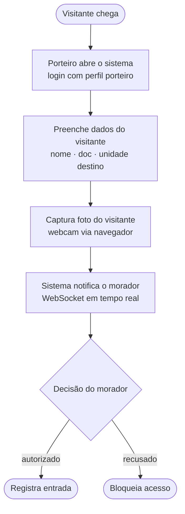
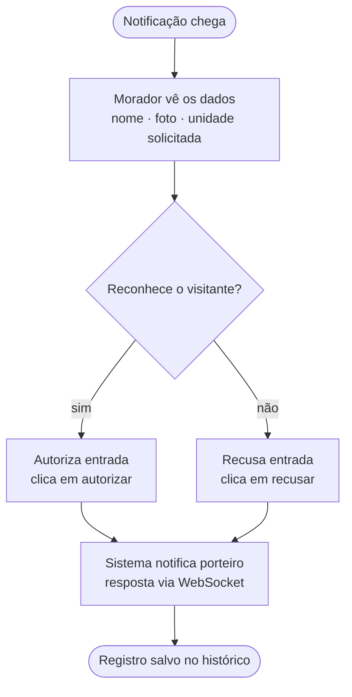
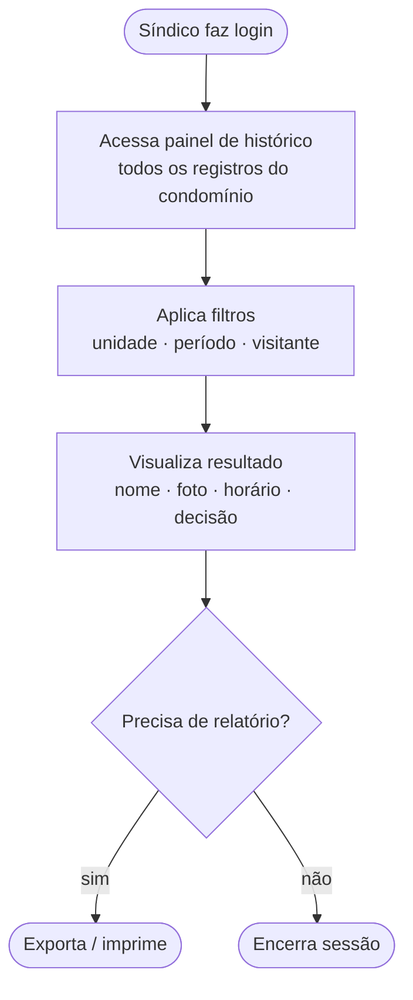
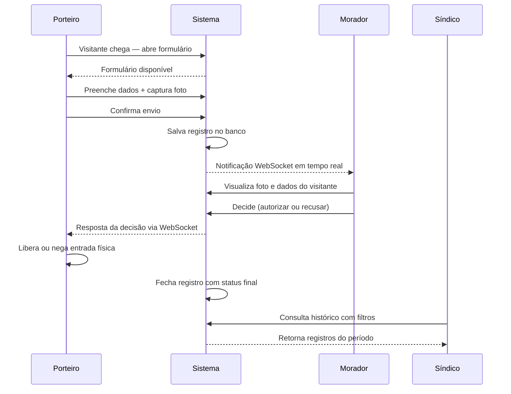

# Portaria Digital — Documentação do Projeto

> TCC — Desenvolvimento de Sistemas · ETEC · 3º Ano  
> Stack: Java + Spring Boot · React.js · MySQL/PostgreSQL

---

## 1. Problema

A maioria dos condomínios residenciais ainda registra visitantes em **cadernos físicos ou planilhas de papel**, sem nenhuma rastreabilidade digital.

- Quando o porteiro não está, não há histórico
- O morador não sabe quem entrou
- O síndico não tem relatório de acesso
- Registros podem ser perdidos, rasurados ou adulterados

Isso representa uma falha grave de segurança em um contexto onde **68 milhões de brasileiros** vivem em condomínios (Abrassp).

> Quando algo dá errado num condomínio, a primeira pergunta é: *"tem registro disso?"* — e a resposta quase sempre é não.

---

## 2. Objetivo Geral

Desenvolver um **sistema web de controle de acesso e gestão de visitantes** para condomínios residenciais, digitalizando o registro da portaria e permitindo que moradores autorizem ou consultem acessos remotamente em tempo real.

---

## 3. Objetivos Específicos

- Cadastrar moradores, unidades e visitantes recorrentes com foto
- Registrar entrada e saída de visitantes com captura de imagem via webcam no sistema do porteiro
- Notificar o morador em tempo real quando um visitante chegar (WebSocket)
- Permitir que o morador autorize ou recuse a entrada pelo sistema web
- Gerar histórico consultável de acessos por unidade e por período (síndico)

---

## 4. Solução Técnica

Sistema web com três perfis de usuário — **porteiro**, **morador** e **síndico** — cada um com painel próprio e permissões controladas via JWT.

### Stack

| Camada | Tecnologia |
|---|---|
| Back-end | Java 17 + Spring Boot 3 |
| Segurança | Spring Security + JWT |
| Tempo real | WebSocket (STOMP + SockJS) |
| Persistência | Spring Data JPA + Flyway |
| Front-end | React 18 + React Router + Axios |
| Banco de dados | MySQL 8 |
| Upload de imagem | `navigator.mediaDevices` (webcam no browser) |

---

## 5. Filtros

| Critério | Avaliação |
|---|---|
| Relevância | ★★★★☆ Alta |
| Grau de dificuldade | ★★★★☆ Alta |
| Viabilidade | ★★★☆☆ Média |

**Ponto de atenção:** WebSocket e captura de imagem elevam a dificuldade. A discussão sobre LGPD na coleta de fotos de visitantes enriquece o TCC com dimensão jurídica. A demonstração ao vivo é visualmente impressionante para a banca.

---

## 6. Argumentos para a Banca

- **68 milhões de brasileiros** vivem em condomínios (Abrassp) — o mercado potencial é enorme e o problema é cotidiano e tangível
- **80% dos consumidores** consideram segurança fator decisivo na compra de imóvel (ABRAINC / Brain Inteligência Estratégica)
- A maioria dos condomínios de pequeno porte ainda usa caderno físico na portaria — a digitalização é um avanço real e imediato, não uma solução em busca de problema
- O uso de **WebSocket** demonstra domínio de comunicação em tempo real — diferencial técnico para bancas de sistemas
- A discussão sobre **LGPD** na coleta de imagens de visitantes demonstra maturidade além do código
- Sistemas como Superlógica, TownSq e uCondo existem para grandes condomínios — o projeto pode se diferenciar focando em **condomínios pequenos sem verba para sistemas pagos**

---

## 7. Estudos e Dados de Referência

| Dado | Fonte |
|---|---|
| 68 milhões de brasileiros em condomínios | Abrassp |
| 80% consideram segurança decisiva na compra de imóvel | ABRAINC / Brain Inteligência Estratégica |
| Redução de até 40% em incidentes com controle de acesso integrado | Allied Market Research |
| Crescimento de 7,1% em investimentos em reconhecimento facial condominial | IDC Brasil |
| 12% dos condomínios já usam portaria virtual | SíndicoNet |

### Artigos e materiais

- **Controle de acesso em condomínios comerciais: segurança e eficiência** — Ponto Tecnologia, out/2024
- **A importância do controle de acesso nos condomínios** — Precisão Administradora, 2024
- **Inovações no controle de acesso transformam a segurança em portarias** — Blog Intelbras, dez/2024
- **Tipos de controle de acesso mais utilizados nas portarias** — Blog Superlógica

---

## 8. Pitch

> *"68 milhões de brasileiros vivem em condomínios. A grande maioria confia sua segurança a um caderno de papel na portaria. Se o porteiro errar o nome, se a folha for perdida, se um visitante voltar em horário diferente — não existe registro. Não existe histórico. Não existe segurança real.*
>
> *Nossa solução digitaliza a portaria: o porteiro registra o visitante com foto em segundos, o morador recebe uma notificação em tempo real no celular e decide se autoriza a entrada — de onde estiver. O síndico acessa o histórico completo de qualquer visita nos últimos meses.*
>
> *Mas não é só sobre registrar. É sobre dar controle de volta a quem mora lá. É sobre a mãe que está no trabalho e consegue ver quem está tentando entrar no apartamento do filho. É sobre o síndico que, pela primeira vez, consegue provar que o procedimento de segurança foi seguido.*
>
> *Hoje, quando algo dá errado num condomínio, a primeira pergunta é: 'tem registro disso?' — e a resposta quase sempre é não. Com nosso sistema, a resposta passa a ser sempre sim.*
>
> *É a segurança que o condomínio já deveria ter, construída com Spring Boot, React e tecnologia que o porteiro consegue usar no primeiro dia — sem treinamento longo, sem complexidade, sem custo de hardware especializado.*
>
> *Porque segurança não deveria depender de letra legível num caderno de papel."*

---

## 9. Pontos Fracos e Como Defender

### "Isso já existe. O que vocês têm de diferente?"

Superlógica, TownSq, uCondo, Condfy — todas já fazem controle de acesso com app, foto e notificação.

**Defesa:** O projeto tem um recorte claro — condomínios pequenos (até 20 unidades) que não têm verba para contratar sistemas pagos. Foco resolve o problema de concorrência.

---

### O WebSocket é frágil sem infraestrutura

Se o morador fechar a aba, a notificação some. Se o servidor cair, a portaria fica cega. WebSocket sem fallback é um ponto de falha.

**Defesa:** Documentar os limites explicitamente no TCC e propor fallback simples (recarregar e buscar status mais recente). Honestidade técnica é melhor que fingir robustez.

---

### LGPD: foto de visitante é dado sensível

Capturar e armazenar imagens de pessoas que não são moradoras exige consentimento explícito, prazo de retenção e possibilidade de exclusão.

**Defesa:** Incluir seção de conformidade LGPD no TCC, política de retenção (ex: imagens deletadas após 90 dias) e fluxo de consentimento no sistema — campo que porteiro marca antes de salvar.

---

### O sistema depende do porteiro — que pode não usar

Tecnologia de portaria falha não por código ruim, mas por adoção humana ruim.

**Defesa:** O fluxo de registro precisa ser mais rápido do que escrever num caderno. Menos de 30 segundos por visitante. Simplicidade operacional é requisito funcional.

---

### Demo ao vivo pode falhar

WebSocket, webcam, notificação em tempo real — tudo depende de rede estável e configuração do navegador.

**Defesa:** Ensaiar exaustivamente. Ter vídeo gravado da demo como backup. Usar localhost ao invés de depender de internet do local da apresentação.

---

### Escopo grande para 6 meses com 5 pessoas

Muitas features simultâneas resultam em tudo incompleto.

**Defesa:** MVP claro definido desde o início — o núcleo são 3 telas: registro (porteiro), autorização (morador), histórico (síndico). Tudo mais é incremento.

---

## 10. Fluxos do Sistema

### Fluxo do Porteiro

---

### Fluxo do Morador

---

### Fluxo do Síndico

---

### Fluxo Conjunto (Sequência)

