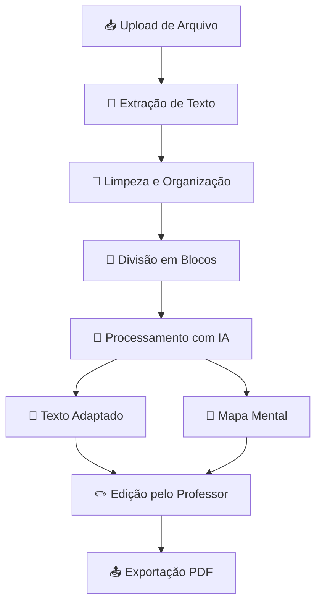
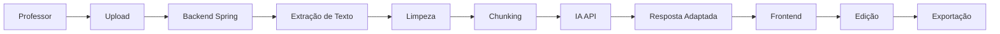
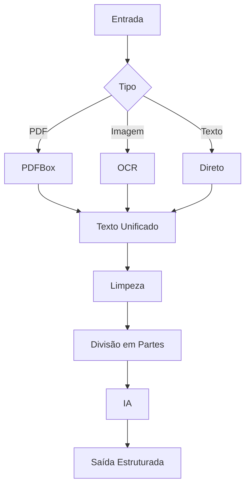
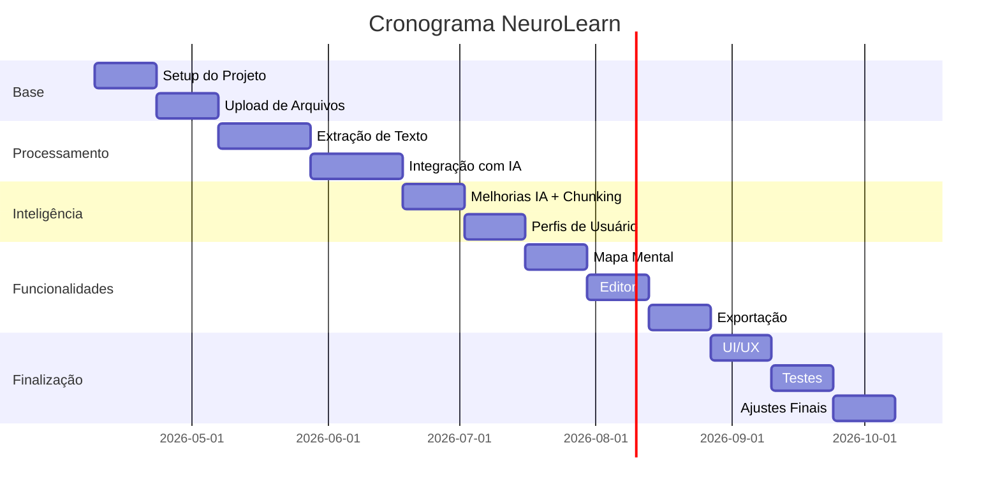

# 🧠📚 NeuroLearn — Plataforma de Adaptação Didática com IA

> **Inteligência Artificial aplicada à educação inclusiva para estudantes com TEA**

---

# 🎯 Visão Geral

O **NeuroLearn** é uma plataforma que utiliza Inteligência Artificial para adaptar materiais didáticos tradicionais (PDFs, imagens, textos) em conteúdos mais acessíveis para alunos com Transtorno do Espectro Autista (TEA), especialmente no ensino médio.

A proposta é:

* Reduzir barreiras de compreensão
* Ajudar professores a adaptar conteúdos rapidamente
* Melhorar a experiência de aprendizagem de alunos neurodivergentes

---

# 🧩 Problema

Professores enfrentam dificuldades como:

* Falta de tempo para adaptar conteúdos
* Ausência de formação em educação inclusiva
* Materiais complexos e pouco acessíveis

Alunos com TEA enfrentam:

* Dificuldade com textos longos
* Problemas com linguagem abstrata
* Sobrecarga cognitiva

---

# 💡 Solução

O sistema:

* Recebe materiais didáticos
* Processa o conteúdo
* Aplica IA para simplificação
* Gera versões acessíveis
* Permite edição pelo professor
* Exporta conteúdo final

---

# 🏗 Arquitetura do Sistema

---

# ⚙️ Stack Tecnológica

## 🔹 Backend

* Java + Spring Boot
* Spring Data JPA
* Lombok

## 🔹 Frontend

* React (interface simples)
* Axios

## 🔹 Banco de Dados

* MySQL (produção)
* H2 (desenvolvimento)

## 🔹 Processamento de Arquivos

* Apache PDFBox (PDF)
* Apache POI (DOCX)
* Tesseract OCR (imagens)

## 🔹 Inteligência Artificial

* API externa (GPT ou similar)

---

# 🔄 Fluxo Completo do Sistema

---

# 🎨 Pipeline de Processamento

---

# 👨‍💻 Separação de Equipe (5 pessoas)

## 🧠 Backend (2 pessoas)

Responsáveis por:

* API (Spring Boot)
* Integração com IA
* Processamento de arquivos
* Banco de dados

---

## 🎨 Frontend (2 pessoas)

Responsáveis por:

* Interface React
* Upload de arquivos
* Exibição de resultados
* Editor de texto

---

## 🔬 IA + Integração (1 pessoa)

Responsável por:

* Criação de prompts
* Testes de qualidade
* Controle de respostas
* Redução de alucinações

---

# 📅 Cronograma (Abril → Outubro)

---

# 🧠 Estratégia de IA (Resumo)

* Uso de API pronta (sem treinar modelo)
* Prompt estruturado
* Chunking (dividir texto)
* Temperatura baixa
* Professor no controle final

---

# 🚀 Diferenciais do Projeto

* ✔ Adaptação automática com IA
* ✔ Foco em TEA nível 1
* ✔ Geração de mapa mental
* ✔ Edição humana (professor)
* ✔ Exportação em PDF
* ✔ Pipeline estruturado (nível profissional)

---

# 🏁 Objetivo Final

Criar uma plataforma funcional que:

* Seja utilizável por professores reais
* Reduza o tempo de adaptação de materiais
* Melhore a compreensão de alunos com TEA
* Demonstre aplicação prática de IA na educação

---

# 📌 Status do Projeto

🚧 Em desenvolvimento
📅 Prazo final: **20 de Outubro de 2026**
🎯 Meta: MVP funcional até **Julho/Agosto**

---

# 💬 Observação Final

> O foco não é apenas tecnologia, mas impacto educacional real.

---
