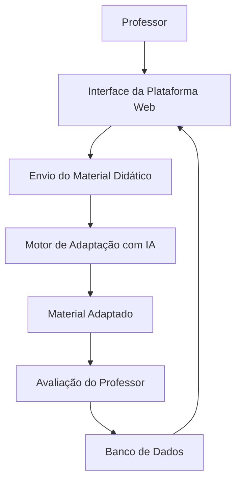
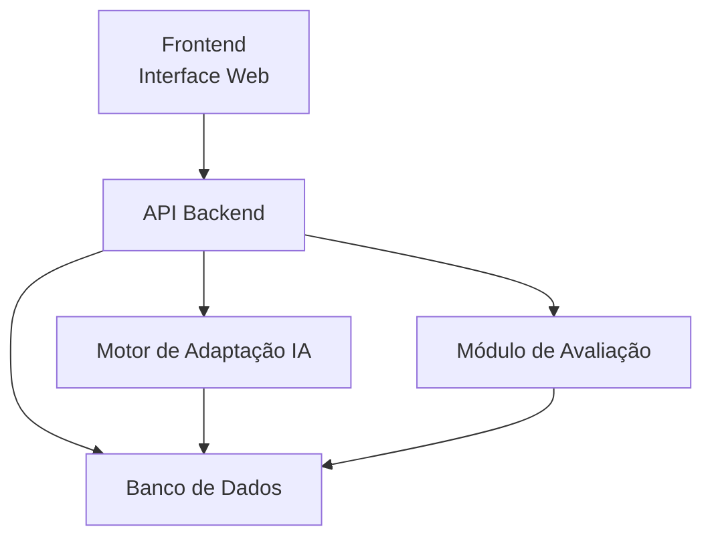
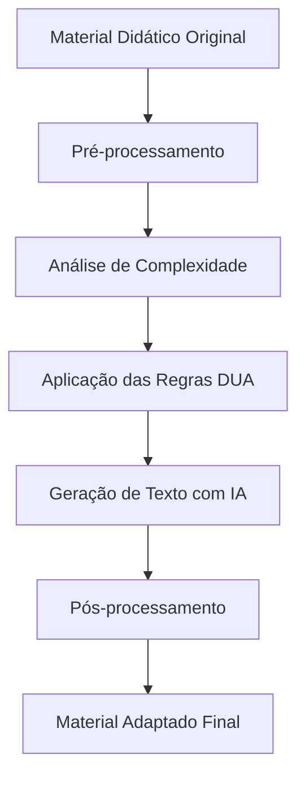
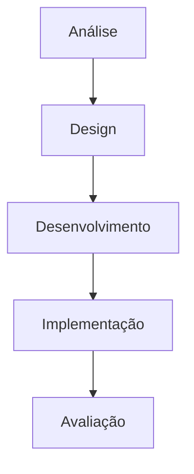
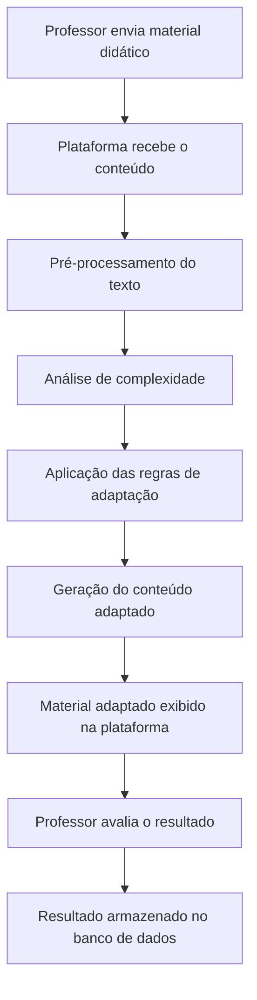

# Arquitetura da Plataforma Educacional com IA para Adaptação de Conteúdo para Estudantes com TEA

Este documento apresenta a arquitetura e o fluxo de funcionamento da plataforma desenvolvida no projeto.  
O objetivo do sistema é adaptar automaticamente conteúdos didáticos do ensino médio para estudantes com **TEA nível 1**, utilizando **Inteligência Artificial**, os princípios do **Desenho Universal para Aprendizagem (DUA)** e o modelo instrucional **ADDIE**.

A plataforma recebe materiais educacionais originais e gera versões adaptadas com maior clareza, organização e acessibilidade.

---

# 1. Visão Geral do Sistema

A arquitetura geral da plataforma envolve três principais componentes:

- Interface da plataforma (utilizada por professores)
- Motor de adaptação baseado em IA
- Banco de dados para armazenamento de conteúdos e avaliações


---

# 2. Arquitetura Técnica do Sistema

A arquitetura técnica foi organizada em camadas para facilitar manutenção, escalabilidade e separação de responsabilidades.


## Camadas do sistema

### Frontend

- Interface utilizada pelos usuários
- Envio de materiais didáticos
- Visualização do conteúdo adaptado

### Backend

- Processamento das requisições
- Comunicação com o motor de adaptação
- Gerenciamento de usuários e conteúdos

### Motor de IA

- Responsável por adaptar os textos
- Aplicação das regras pedagógicas baseadas no DUA

### Banco de Dados

- Armazenamento de textos originais
- Armazenamento de textos adaptados
- Registro das avaliações feitas pelos professores

---

# 3. Pipeline de Processamento da Inteligência Artificial

O processo de adaptação do conteúdo ocorre em múltiplas etapas para garantir clareza e acessibilidade.



## Etapas do processamento

### Pré-processamento

- limpeza do texto
- identificação de parágrafos
- detecção da estrutura do conteúdo

### Análise de complexidade

- tamanho das frases
- vocabulário utilizado
- densidade de informação

### Aplicação das regras do DUA

- simplificação da linguagem
- divisão em tópicos
- destaque de conceitos principais
- inclusão de exemplos concretos

### Geração com IA

- reescrita do conteúdo de forma acessível

### Pós-processamento

- organização visual do conteúdo
- formatação em listas ou etapas
- destaque de palavras-chave

---

# 4. Fluxo Pedagógico Baseado no Modelo ADDIE

O desenvolvimento da plataforma também segue o modelo instrucional ADDIE.



## Etapas aplicadas no projeto

### Análise

- identificação de dificuldades de leitura
- levantamento das necessidades de estudantes com TEA nível 1

### Design

- definição das regras de adaptação
- aplicação dos princípios do DUA

### Desenvolvimento

- implementação do motor de adaptação com IA
- integração com a plataforma

### Implementação

- disponibilização da ferramenta para uso por professores

### Avaliação

- análise da clareza do material adaptado
- validação pedagógica do conteúdo

---

# 5. Fluxo Completo do Sistema

O funcionamento completo da plataforma ocorre conforme o fluxo abaixo.



---

# 6. Métrica de Complexidade do Texto

Para apoiar a avaliação do sistema, é possível calcular um índice de complexidade textual antes e depois da adaptação.

### Exemplo:

*Texto original*

```text
Complexidade: 8.1 / 10
```

*Texto adaptado*

```text
Complexidade: 4.3 / 10
```

Essa métrica permite verificar se o sistema realmente reduz a complexidade do conteúdo, tornando-o mais acessível para estudantes com TEA.

---

# Conclusão

A arquitetura proposta integra metodologias pedagógicas e tecnologia de Inteligência Artificial para apoiar a adaptação de conteúdos educacionais.
A utilização do modelo ADDIE garante organização no processo de desenvolvimento pedagógico, enquanto o Desenho Universal para Aprendizagem (DUA) orienta as regras de adaptação aplicadas pela IA.

A plataforma busca contribuir para a inclusão educacional, oferecendo suporte para que professores possam disponibilizar materiais mais acessíveis para estudantes com TEA.
